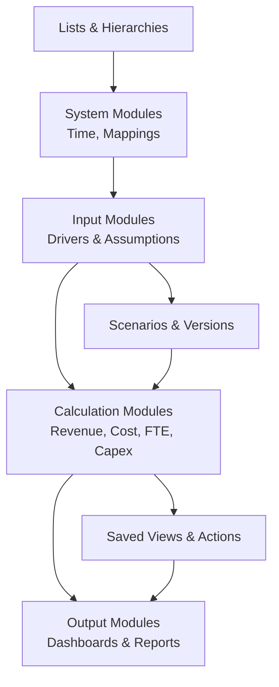
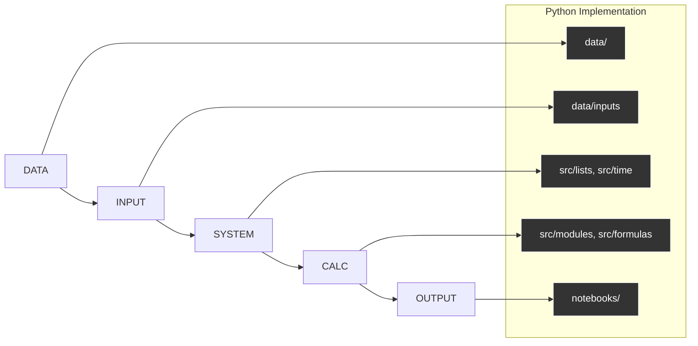

# Anaplan Modelling Lab
### *A Connected Planning Portfolio by Dr Siddharth Kulkarni*  
**“Where structured modelling meets scalable decision‑making.”**

---

## Overview
The **Anaplan Modelling Lab** is a portfolio of Python-based planning models designed to replicate Anaplan’s modelling philosophy — **Lists, Modules, Line Items, Time, Versions, Scenarios, DCA, Saved Views, and ALM‑style governance** — using modern open‑source tools.

The portfolio follows Anaplan’s official modelling frameworks:

- **The Planual** -- sustainable, rule‑based modelling conventions
- **PLANS** -- Performance • Logical • Auditable • Necessary • Sustainable
- **DISCO** -- Data • Input • System • Calculation • Output
- **Model Optimization Checklist** -- Lists → Modules → Line Items → Formulas → Actions → Time
- **Module Configuration Best Practices** -- Applies To, Time Scale, Versions, Breakback, selective access

This lab re‑creates these design principles in Python so planners and modellers can practice Anaplan-style thinking with fully open tools.

---

## Architecture

### Connected Planning Stack (Python Edition)

---

## Why This Portfolio Exists
To explore how enterprise planning systems can be reverse‑engineered in Python using:

- **Dimensional Modelling Discipline**  
- **System Thinking across end‑to‑end workflows**  
- **Reusable, scalable calculation modules**  
- **Readable, auditable structure** inspired by Planual & PLANS  
- **Interactive notebooks** that explain not just numbers, but logic  

This is both a **learning lab** and a **showcase of model architecture craftsmanship**.

---

## Portfolio Contents

Each model folder contains:

- **Business Case Notebook**  
  Problem framing, dimensionality, formula design, outputs  

- **Python Modeling Code**  
  Anaplan-style Lists, Modules, Time Engine, DCA, Actions  

- **Visuals & UX**  
  Scenario charts, time-series views, waterfalls, variance dashboards  

- **Model Notes**  
  Mapping to Planual, PLANS, DISCO, and Optimization Checklist  

---

## Models Included

### 1. Lists & Hierarchies Engine  
Rollups, subsets, SYS modules for structural metadata  

### 2. Time Intelligence Engine  
PREVIOUS(), CUMULATE(), TIMESUM(), Time Ranges  

### 3. Module Framework (xarray-based)  
Line items, dimensional alignment, applies‑to metadata  

### 4. Scenario & Version Manager  
Base, Upside, Downside, Variance, % Variance, Sensitivity  

### 5. FP&A Core Model  
Revenue → Opex → Capex → Depreciation → NWC → FCF → NPV  

### 6. Workforce Planning Model  
FTE, salary, oncost, hiring plan, churn, DCA-inspired access  

### 7. S&OP Planning Engine  
Demand → Supply → Production → Inventory → Constraints  

### 8. Saved Views & Actions  
Programmatic exports mirroring Anaplan processes  

### 9. ALM Simulation  
DEV → TEST → PROD workflow using Git branches & revision tags  

---

## DISCO Structure

---

## Explore the Models
- Browse the notebooks for model walkthroughs  
- Review the reusable engine in `src/`  
- Connect on LinkedIn to collaborate or discuss modelling systems  

**“Planning is architecture. Build it like it matters.”**
